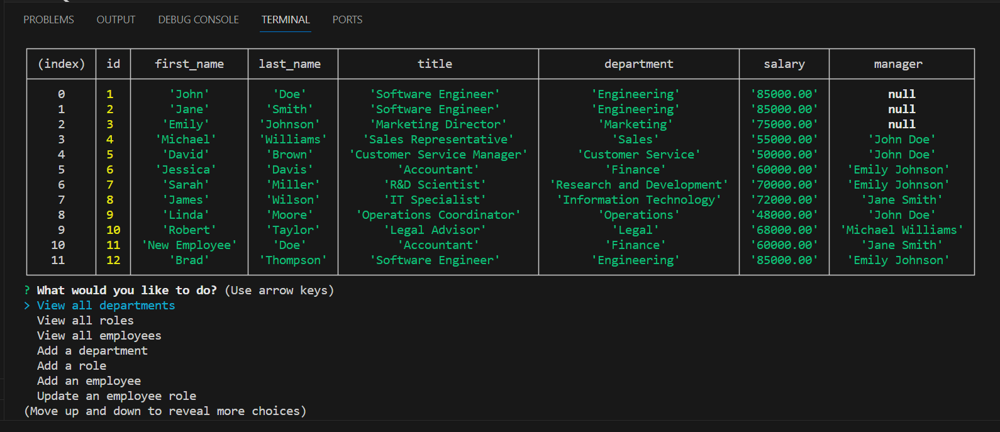

# Employee Tracker CLI

## Description

Employee Tracker is a command-line application that allows business owners to view and manage the departments, roles, and employees in their company. This tool aims to facilitate the organization and planning of business operations.

## Table of Contents

- [Installation](#installation)
- [Usage](#usage)
- [Features](#features)
- [Contributing](#contributing)
- [Screenshots](#screenshots)
- [Video Demonstration](#video-demonstration)
- [Questions](#questions)

## Installation

To get started with Employee Tracker, follow these steps:

1. Ensure that you have Node.js and MySQL installed on your system.
2. Clone the repository to your local machine.
3. Navigate to the directory where you cloned the repository.
4. Install the required npm packages by running: `npm install inquirer@8.2.4 mysql2`

## Usage

To launch the Employee Tracker application, execute the following command in the terminal:
`node server.js`

Navigate through the menu with the arrow keys and select options by pressing Enter.

## Features

- View all departments, roles, and employees within the company.
- Add new departments to categorize roles and employees.
- Create roles with associated titles, salary, and department.
- Add employees with details including their name, role, and manager.
- Update existing employee roles to reflect changes in their job title or department.

## Contributing

Contributions to Employee Tracker are welcome. Please ensure that your code adheres to the existing style and that all tests pass before submitting a pull request.

## Screenshot

- 

## Video Demonstration

Link to the [video demonstration](https://drive.google.com/file/d/1cPVCdS97C0DxplcRRZcC764q1qFuL8ZU/view)
Link to [Github Repo](git@github.com:alamm01/emptracker.git)

## Questions

For any questions or concerns regarding the Employee Tracker, please open an issue on GitHub or reach out to the repository owner.

[GitHub Profile](https://github.com/alamm01)
